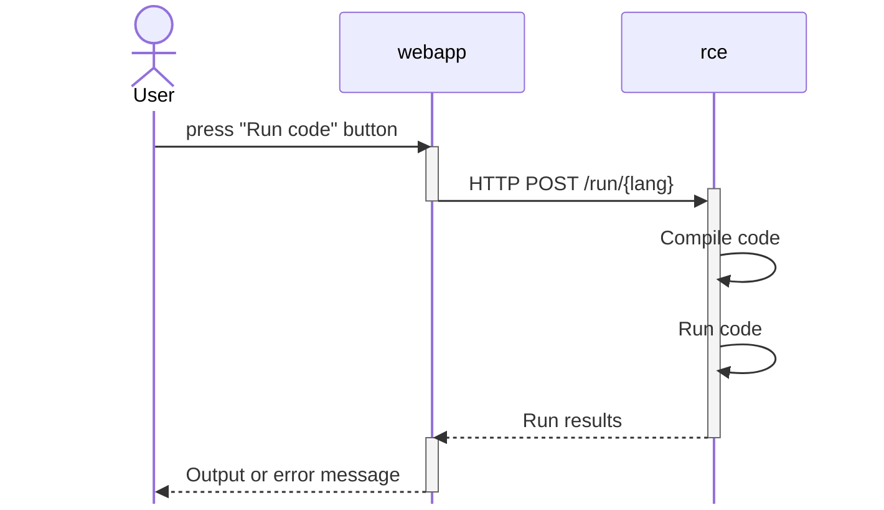

# oq

The **Project Obscure Questionnaire** platform.

# Architecture

The oq platform currently has the following parts:

 - **webapp** — a [SvelteKit][] full-stack application that is what users see when they
   interact with the application. The webapp is also responsible for maintaining
   the database schema.
 - **rce** — the remote code execution engine. At the current writing (2023-11-14),
   an demo application is in place that is **not suitable for production**. See issue #4

In the future, I might add the following:

 - **db** — a relational database management system. As of 2023-11-14, I am
   using SQLite3, but if I need more concurrency, I plan to switch to PostgreSQL.

[SvelteKit]: https://kit.svelte.dev

## How user compliation works

Here is the flow of a users' code can be compiled and run:



# System requirements

You will need:

 - Docker (I am using v4.25.0)
 - Node (I am using Node v20.4.0)

# Development


> [!IMPORTANT]
> See [Installing new npm packages](#installing-new-npm-packages) as things are not straightforward.

This is my development setup:

 - I setup all of my nodejs stuff on my **host** machine (for me, that's my Mac).
    - go into `./webapp` and run `npm install`
 - I use Visual Studio Code with the Prettier extension to edit files.
 - I use [Docker Compose][] to run the development server.

To setup the dev environment for the first time, you **must** do the following
after clone:

```sh
ln -s docker-composer.{dev,override}.yml
```

Subsequently, you can bring up everything using the following command:

```sh
docker-compose up --build
```

Note: I do **not** daemonize `docker-compose` (i.e., provide the `-d` option)
during development.

After this, you should have a live-reloading version of the site on
<http://localhost:3000/>.

[Docker Compose]: https://docs.docker.com/compose/

## Installing new npm packages

The way that I have a live reloading dev environment within Docker compose is a
bit of a hack. As a result, you can't just install an npm package with `npm
install --save example` and expect it to work. Here's what you need to do:

**tl;dr**

```sh
cd webapp
npm install «PACKAGE» --save-dev
cd ..
docker compose down --volumes
docker volume prune --filter all=1
docker compose up --build
```

### Install your package normally

Within the `./webapp` directory, `npm install` your package. Remember to provide
`--save` or `--save-dev` to commit the package to `package.json`.

####  How to choose between `--save` or `--save-dev`

If the module will be imported at runtime by the webapp server (anything used in
`$lib/server` for instance), then it should be installed via `--save`:

For example, 

```sh
npm install http-status-codes --save
```

Anything else should use `--save-dev`.  With `--save-dev`, the package will only
be required at build time, so it does not need to be in `node_packages` when the
server is deployed, saving space in deployed image!

### Bring docker compose down

Run the following command:

```sh
docker compose down --volumes
```

This will shut down the entire system and remove the currently used containers.
**Importantly**, `--volumes` removes the anonymous volume used to store
`node_modules` in the development container. If you don't remove this volume,
then the container will act as if you never ran `npm install` at all!

### (optional) Remove unused anonymous volumes

The anonymous volume stores the full dev version of `node_modules` — you
probably want to get rid of it.


Docker does not delete the anonymous volume with the previous command,
*even though no container will ever use it anymore*.

As of 2023-11-14, this is the command to remove unused, anonymous volumes:

```sh
docker volume prune --filter all=1
```

### Rebuild the image and bring it all back up

Now you can bring everything back up, but you will need to rebuild the image.

```sh
docker compose up --build
```

This will:
 1. Rebuild all Docker images needed for the entire application — not just the webapp
    - Rebuilding the webapp image will also install all of `node_modules`
 2. Create a **new** anonymous volume for `node_modules`.
 3. Copy the brand new `node_modules` from the image into the new anonymous volume.

In practice, I always run `docker compose up --build` to bring everything up,
even if I'm not messing around with npm packages.

## Database migrations

See `webapp/README.md` for details on how to run the database migrations.

# Deployment on beckett4

To deploy, you **must** run:

```sh
ln -s docker-composer.{prod,override}.yml
```

**TODO**: Eddie needs to write more documentation here!